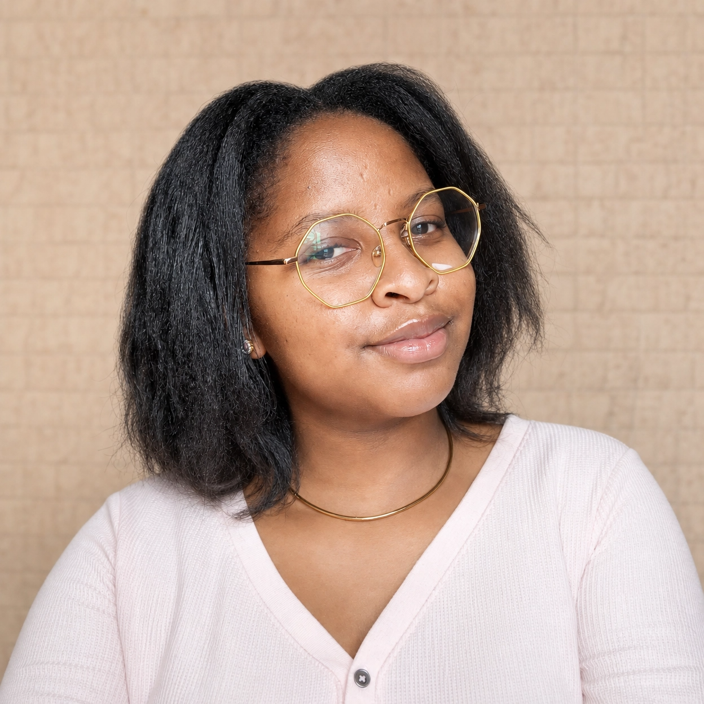

::: {.hero-grid}
::: {.hero-photo-col}
::: {.hero-photo-frame}
{fig-alt="Portrait of Caroline Gachema"}
:::
### Caroline Gachema {.hero-name}
[Biomedical Scientist & Bioinformatician]{.hero-role}

::: {.hero-icons}
<a href="https://github.com/CarolGachema"><i class="bi bi-github"></i></a>
<a href="https://www.linkedin.com/in/caroline-gachema-67181a2b8/"><i class="bi bi-linkedin"></i></a>
<a href="mailto:gachemacarol@gmail.com"><i class="bi bi-envelope"></i></a>
:::
:::

::: {.hero-intro-col}
## Hi! Thanks for stopping by!

I explore the molecular mechanisms that connect different disciplines. 

My work combines publicly available genomic data, statistical modelling, and systems biology to investigate hypotheses that are often overlooked by conventional disciplinary boundaries.

I aim to produce research that is both computationally rigorous and biologically meaningful.

  <i class="bi bi-mortarboard-fill"></i>
  <a href="#">BSc. Biomedical Science and Technology</a>

  <i class="bi bi-award-fill"></i>
  <a href="#">Bioinformatics and Nanotechnology</a>

  <i class="bi bi-award-fill"></i>
  <a href="#">NUITM BSL-3/P3</a>

:::
:::

