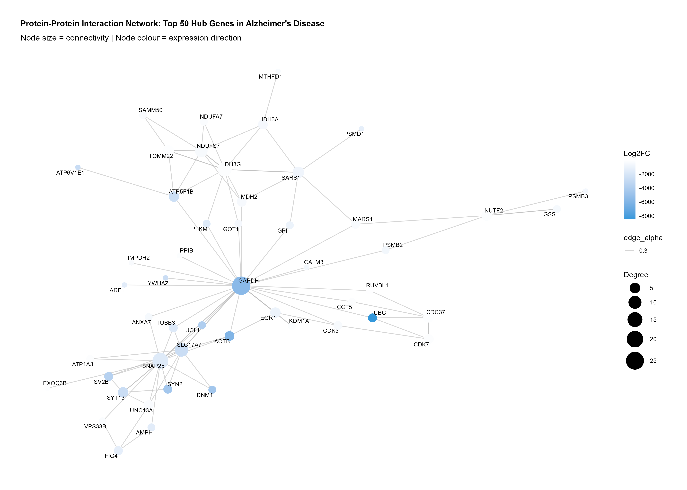
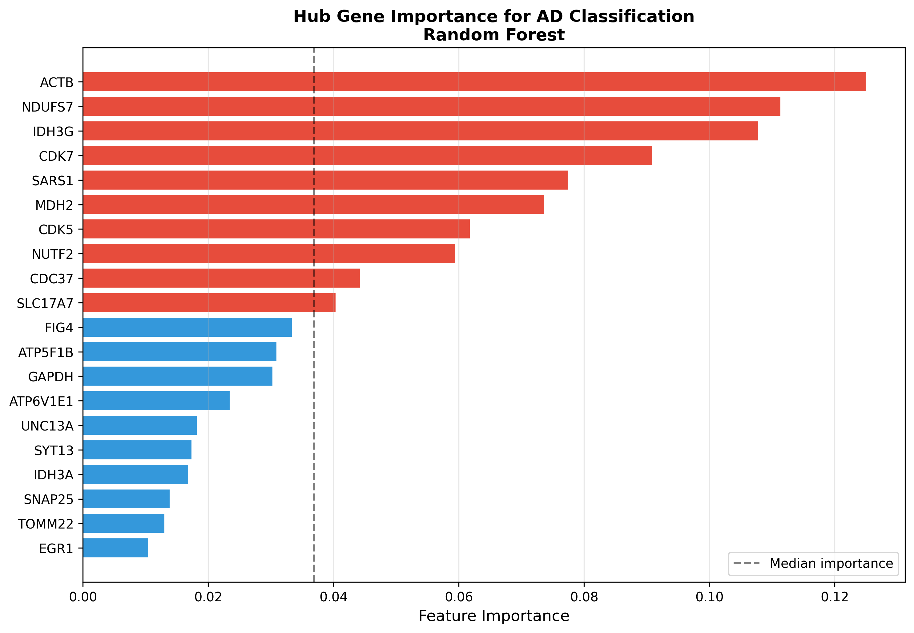
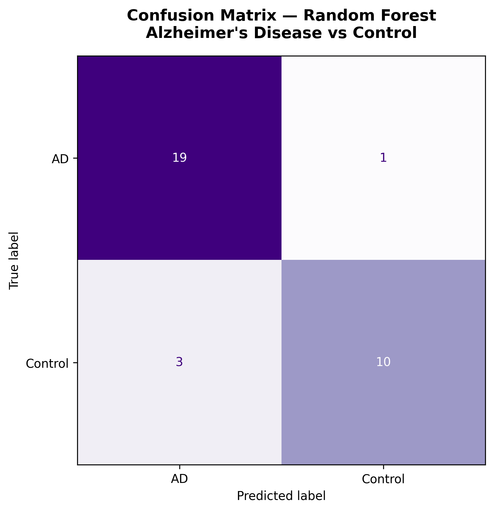

  <a href="https://github.com/CarolGachema/Alzheimer-Hub-Genes-ML" class="research-btn" target="_blank">
    <i class="bi bi-github"></i> Code
  </a>

## Overview

Gene expression studies have shown that Alzheimer's disease affects thousands of genes simultaneously, influencing neuronal metabolism, mitochondrial function, synaptic signalling, cytoskeletal organisation, protein degradation, and immune activation.

Network biology provides a powerful framework for doing exactly this. Within biological networks, some genes occupy central positions, interacting with numerous partners and coordinating essential cellular processes. 

These hub genes often exert disproportionate influence over disease progression and therefore represent attractive therapeutic targets.

Machine learning offers another complementary perspective.Predictive models ask whether combinations of molecular features are sufficiently informative to classify disease status. If successful, such approaches provide evidence that underlying biological signals are statistically and biologically meaningful.

## Data & methods

All analyses were performed using publicly available transcriptomic datasets obtained from the NCBI Gene Expression Omnibus (GEO).

- **Accession:** GSE5281

- **Platform:** GPL570 (Affymetrix Human Genome U133 Plus 2.0 Array)

- **Samples:** Alzheimer's disease and neurologically healthy control brain tissue

The dataset includes expression profiles from multiple anatomically distinct brain regions, allowing investigation of disease-associated molecular changes across the central nervous system.

- **Transcriptomic expression data** from [GSE5281] comparing Alzheimer's disease cases to cognitively normal controls.
- **Gene co-expression network analysis** (protein-protein interaction network) used to identify hub genes most central to disease associated modules.
- **Hub genes** carried forward as the feature set for a Random Forest classifier, implemented in Python (scikit-learn).
- **Model performance** assessed via cross validation to avoid overfitting to a single train/test split.

{#fig-network fig-alt="Gene co-expression network with hub genes highlighted" width=80% fig-align="center"}

The full analysis pipeline and code are released openly on GitHub for reproducibility.

## Findings

The Random Forest classifier achieved **90.7% cross-validation accuracy** in distinguishing Alzheimer's disease from cognitively normal controls using only the hub-gene feature set.
This supports the core hypothesis: network-derived hub genes carry enough disease relevant signal to drive accurate classification on their own.

::: {layout-ncol=2}
{fig-alt="Bar chart of Random Forest feature importances"}

{fig-alt="Confusion matrix showing classification performance"}
:::

