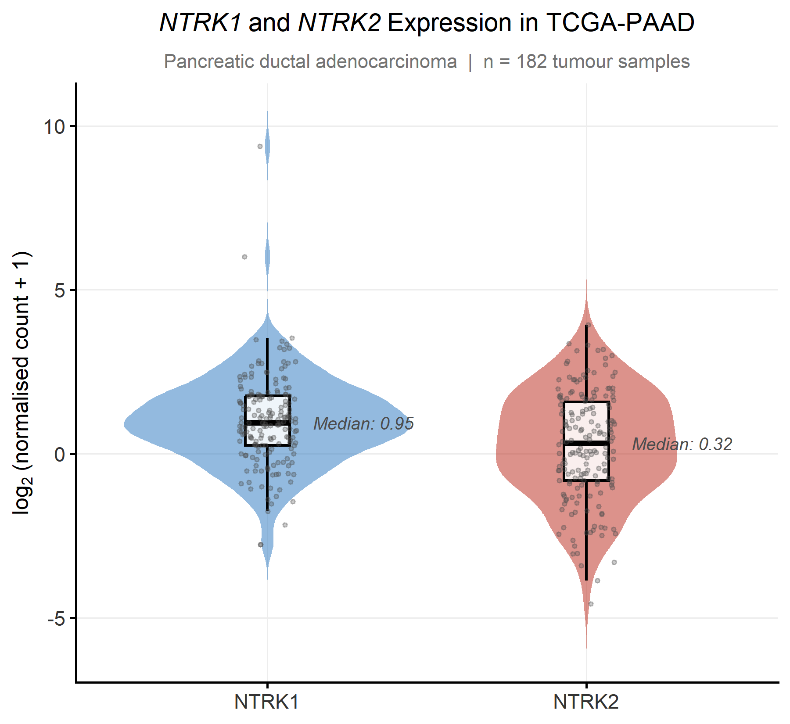
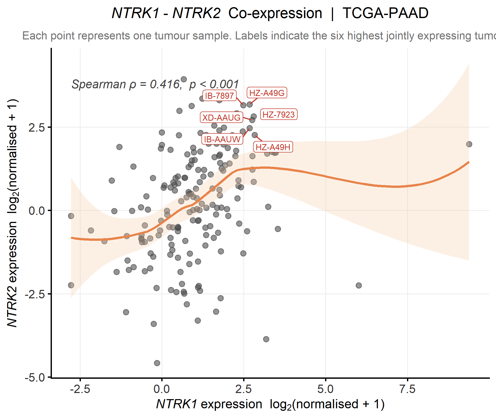
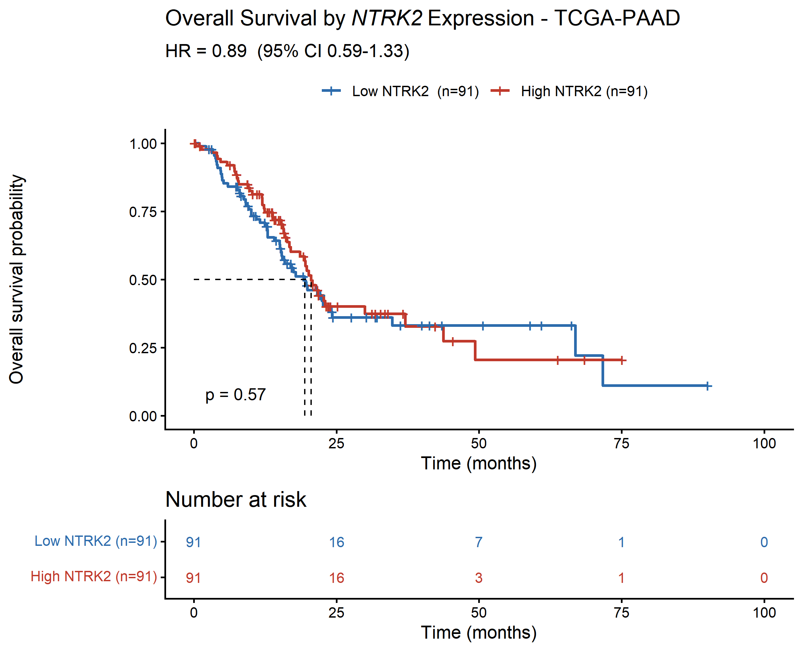
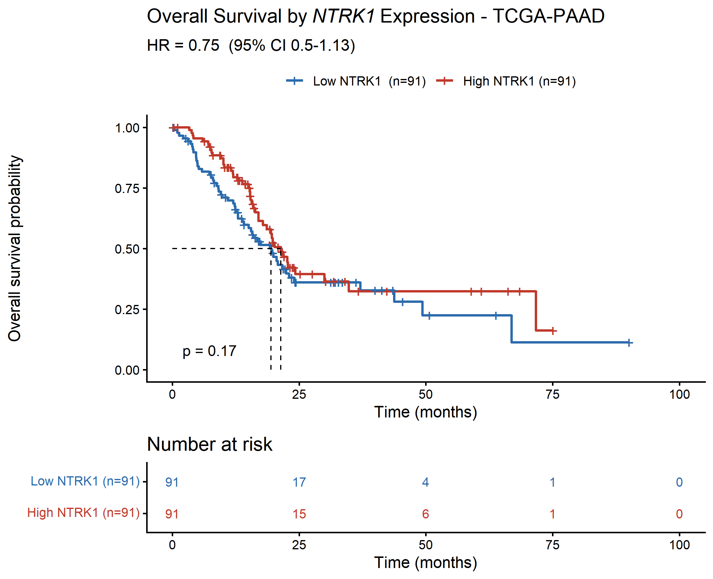
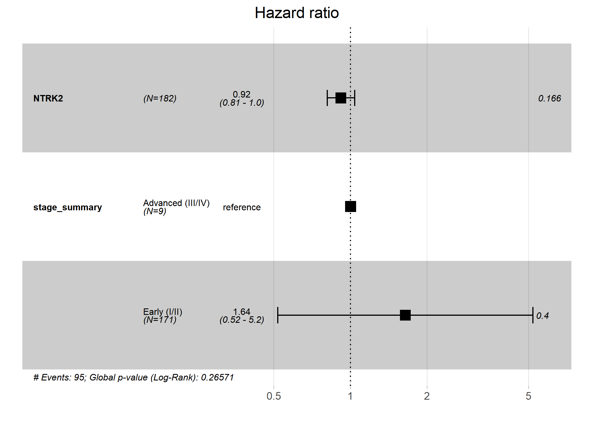
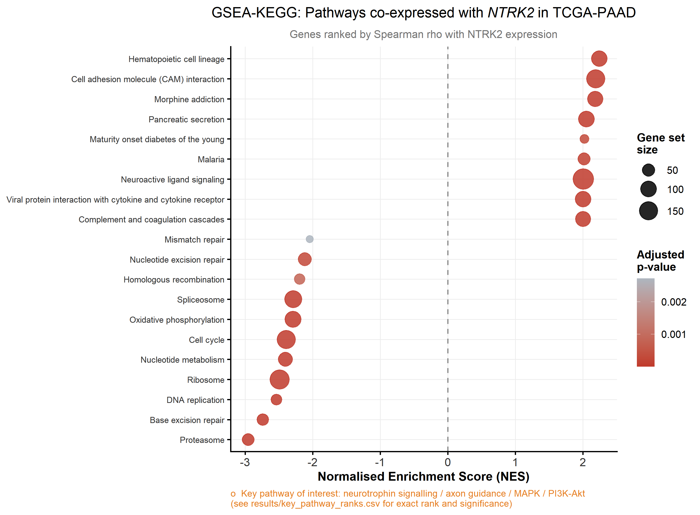
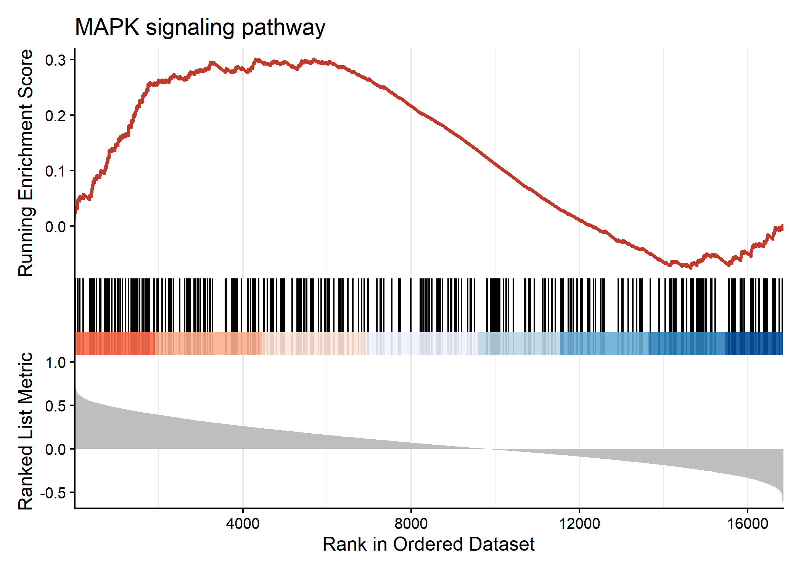
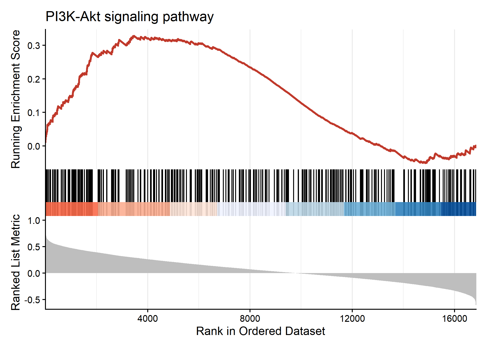

  <a href="https://github.com/CarolGachema/TCGA-PAAD-NTRK" class="research-btn" target="_blank">
    <i class="bi bi-github"></i> Code
  </a>

## Overview

Neurotrophins are essential regulators of neuronal survival, differentiation, synaptic plasticity, and axonal growth throughout development and adulthood.

Among their receptors:

**TrkA (NTRK1)** primarily binds nerve growth factor (NGF).
**TrkB (NTRK2)** preferentially binds brain-derived neurotrophic factor (BDNF).
**TrkC (NTRK3)** responds mainly to neurotrophin-3 (NT-3).

These receptors possess distinct ligand preferences, but, their intracellular signalling networks overlap extensively.

Activation of either TrkA or TrkB stimulates pathways involved in:

- Cell survival
- Cell proliferation
- Neuronal differentiation
- Synaptic plasticity
- Cytoskeletal remodelling
- Angiogenesis
- Migration
- Apoptosis resistance

These same biological programmes are frequently exploited during cancer progression.

*Pancreatic cancer* is particularly unusual because tumour cells actively communicate with peripheral nerves.

PDAC establishes reciprocal signalling loops with neurons, Schwann cells, fibroblasts, immune cells, and extracellular matrix components to facilitate tumour growth and dissemination.

**Neurotrophin signalling** is increasingly recognised as one of the major molecular drivers of this process.

Simultaneously, psychedelic neuroscience has identified TrkB activation as a key mechanism underlying sustained structural plasticity following psilocybin exposure.

The possibility that these receptor systems coexist within pancreatic tumours therefore deserves further investigation.

### Current Progress

As of mid-2026, both of Compass Pathways' pivotal Phase 3 trials of COMP360 psilocybin for treatment resistant depression  **(COMP005 and COMP006)** have met their primary endpoints, with a durable benefit reported through at least six months and a generally well tolerated safety profile. An FDA filing is targeted for Q4 2026. 

Clinical trials testing psilocybin assisted therapy for cancer-related psychological distress have existed for close to a decade already; a regulatory approval for psilocybin in any indication makes it dramatically more likely that patients carrying both a depression diagnosis and a PDAC diagnosis will be offered, or will seek out, this treatment.

## Data & methods

- **Gene set enrichment analysis (GSEA)** testing whether neurotrophin-associated expression programs linked to TrkB/plasticity biology show a parallel signature in PDAC tumour tissue

- **Validation cohort:** TCGA-PAAD, 182 primary pancreatic tumour samples with matched clinical and survival data

- **Survival analysis (Kaplan-Meier)** to test whether pathway activity predicts patient outcomes, not just differential expression

- Analysis conducted in R

## Findings

### Expression and co-expression

{#fig-expr fig-alt="Violin plot of NTRK1 and NTRK2 expression distribution" width=75% fig-align="center"}

{#fig-coexpr fig-alt="Scatter plot showing correlation between NTRK1 and NTRK2 expression" width=75% fig-align="center"}

Both receptors are detectable across the cohort, but *NTRK1* is expressed substantially higher and more variably *(median log₂ = 0.95)* than *NTRK2* *(median log₂ = 0.32)*, with a right skewed tail of high-TrkA outlier tumors, consistent with TrkA's established, active role in driving perineural invasion in a subset of aggressive tumors.

*NTRK2* is the more interesting number precisely because it's lower. TrkB is not a gene you'd expect to see much of outside brain tissue at all, finding it reliably expressed in a solid pancreatic tumor sample is

### Survival analysis

::: {layout-ncol=2}
{fig-alt="Kaplan-Meier survival curve stratified by NTRK2 expression"}

{fig-alt="Kaplan-Meier survival curve stratified by NTRK1 expression"}
:::

{#fig-forest fig-alt="Forest plot of Cox proportional hazards model for NTRK2, adjusted for tumour stage" width=70% fig-align="center"}

Neither gene showed a statistically significant association with overall survival at median-split dichotomization. A stage-adjusted, continuous Cox model for *NTRK2* showed a similar non-significant trend (per-unit HR = 0.92, 95% CI 0.81–1.0, p = 0.166).

### Pathway enrichment

{#fig-dotplot fig-alt="Dotplot of enriched KEGG pathways from GSEA" width=75% fig-align="center"}

::: {layout-ncol=2}
{fig-alt="GSEA enrichment plot for MAPK signaling pathway"}

{fig-alt="GSEA enrichment plot for PI3K-Akt signaling pathway"}
:::

Ranking every gene in the genome by its correlation with *NTRK2* expression surfaced a coherent pattern. Tumors with higher *NTRK2* showed enrichment for neuroactive ligand signaling, cell adhesion, pancreatic secretion, and hematopoietic lineage pathways, and in the opposite direction, depletion of core proliferation machinery, the proteasome, ribosome, cell cycle, and DNA replication/repair pathways. 

Put together, that reads as, tumors with more *NTRK2* signal look less proliferative and more differentiated, or more accurately, more neurally, and microenvironment associated, which fits the interpretation above. 

Inside that pattern, the two pathways this project actually set out to check MAPK and PI3K-Akt, the shared downstream architecture between TrkA and TrkB.
